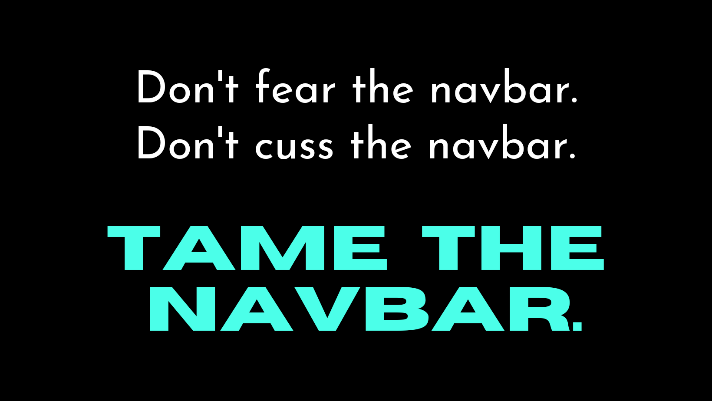

# Welcome to My Navigation Library 

Navigation can be tough to tackle when you're starting out, but it's a great opportunity to work out your programming skills. There can be a lot going on in that tiny space...responsiveness, flexbox, grid, events, transitions, buttons, links, lists, animations, hover effects, images, SVGs, and on and on.

I created this resource as a reference for myself and anyone who may be struggling with building navigation components. As long as I'm building new navbars, I will update and maintain this repo.

Keep in mind, the focus here is more on programming than design. So feel free to study the code, fix it, build on it, add some design bling, and make it work for your unique project.

Have fun and let me know if you found some inspiration here!

## 👋 Contact Me

If you find this navigation library helpful or have feedback, suggestions, or questions, feel free to get in touch. You can find me at:

- My website [@christadejesus.com](https://christadejesus.com)
- Connect with [@christa-dejesus](https://www.linkedin.com/in/christa-dejesus/) on LinkedIn
- Follow [@christadejesus](https://codepen.io/christadejesus) on codepen
- Follow [@christadejesus](https://github.com/christadejesus) on Github

## How to View Navigation Examples

&rarr; Check out the source code on [github](https://github.com/christadejesus/navigation).

&rarr; View this collection on [codepen](https://codepen.io/collection/yrPyag).

&rarr; Check out the live demos of each navigation example by clicking on the links below:

| Name | Tech |
| ---- | ---- |
| [Top Nav Minimal 1](https://christadejesus.github.io/navigation/top-nav-minimal-1) |HTML/CSS/JS | 
| [Top Nav Minimal 2](https://christadejesus.github.io/navigation/top-nav-minimal-2) | HTML/CSS/JS |
| [Top Nav Minimal 3](https://christadejesus.github.io/navigation/top-nav-minimal-3) | HTML/CSS/JS |
| [Bottom Social Bar](https://christadejesus.github.io/navigation/bottom-social-bar) | HTML/CSS |
| [Top Nav + Bottom Social Bar](https://christadejesus.github.io/navigation/top-nav-bottom-social-bar) | HTML/CSS/JS |
| [Top Nav + Footer Nav](https://christadejesus.github.io/navigation/top-nav-footer-nav) | HTML/CSS/JS |
| [Fixed Top Nav + Bookmark Links](https://christadejesus.github.io/navigation/fixed-top-nav-bookmark-links) | HTML/CSS/JS |
| [3-Tier Top Nav ](https://christadejesus.github.io/navigation/3-tier-top-nav) | HTML/CSS |
| [Fixed Top Nav + Footer Nav ](https://christadejesus.github.io/navigation/fixed-top-nav-footer-nav) | HTML/CSS/JS |
| [Fixed Top Nav Tabs ](https://christadejesus.github.io/navigation/fixed-top-nav-tabs) | HTML/CSS/JS |
